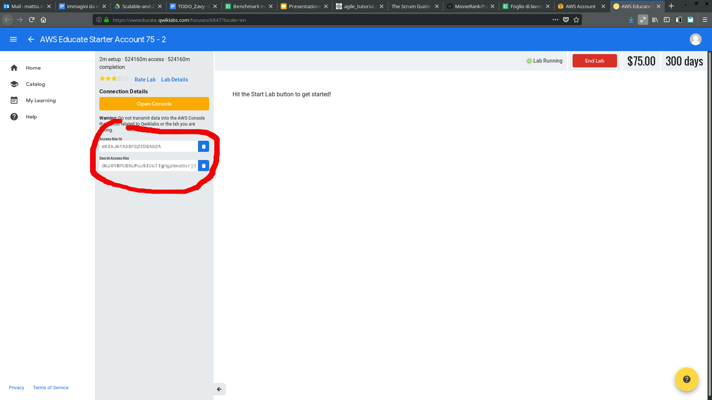

# MovieRank

## Formato dataset
- Id film
- Id utente
- helpfulness
- score
- timestamp
- titolo
- contenuto

## Algoritmi

- **Pagerank Utente** : tecnicamente poco simile all'algoritmo Pagerank originale. Viene considerata l'utilita' media di ogni utente (il rank); questa viene poi incrementata per ogni recensione con un voto simile ad altre che hanno un'utilita' maggiore. In sostanza, chi esprime un opinione analoga ad altri utenti che sono stati giudicati utili eredita parte di questa utilita'. Ne esistono diverse versioni, semplici/complesse od ottimizzate/inefficienti.

- **User suggestion**: semplice algoritmo di recommending di contenuti. Utenti che hanno dato lo stesso voto a un film vengono accorpati e ricevono consigli sui film che uno ha gia' visto e l'altro no.

- **Operazioni di base**: Oltre ai due precendenti grandi algoritmi si considerano anche operazioni piu' semplici, implementate inizialmente come studio: 

    - Correlazione tra utilita' e lunghezza della review
    - Correlazione tra utente e score
    - Correlazione tra utente e helpfulness
    - Correlazione tra film e score
    - Correlazione tra film, score e data

## Getting started

### Installare flintrock

Installare flintrock tramite pip:

``` bash
pip3 install flintrock
```

Oppure come versione standalone; vedere la pagina [Github](https://github.com/nchammas/flintrock#installation) di flintrock.

### Configurazione

Configurare flintrock con il comando `flintrock configure`. Questo creera' un file di configurazione in $HOME/.config/flintrock/config.yaml, di default come segue:

```code=yaml
services:
  spark:
    version: 2.1.0
    # git-commit: latest  # if not 'latest', provide a full commit SHA; e.g. d6dc12ef0146ae409834c78737c116050961f350
    # git-repository:  # optional; defaults to https://github.com/apache/spark
    # optional; defaults to download from from the official Spark S3 bucket
    #   - must contain a {v} template corresponding to the version
    #   - Spark must be pre-built
    #   - must be a tar.gz file
    # download-source: "https://www.example.com/files/spark/{v}/spark-{v}.tar.gz"
  hdfs:
    version: 2.7.3
    # optional; defaults to download from a dynamically selected Apache mirror
    #   - must contain a {v} template corresponding to the version
    #   - must be a .tar.gz file
    # download-source: "https://www.example.com/files/hadoop/{v}/hadoop-{v}.tar.gz"

provider: ec2

providers:
  ec2:
    key-name: key_name
    identity-file: /path/to/key.pem
    instance-type: m3.medium
    region: us-east-1
    # availability-zone: <name>
    ami: ami-0b33d91d   # Amazon Linux, us-east-1
    user: ec2-user
    # ami: ami-61bbf104   # CentOS 7, us-east-1
    # user: centos
    # spot-price: <price>
    # vpc-id: <id>
    # subnet-id: <id>
    # placement-group: <name>
    # security-groups:
    #   - group-name1
    #   - group-name2
    # instance-profile-name:
    tenancy: default  # default | dedicated
    ebs-optimized: no  # yes | no
    instance-initiated-shutdown-behavior: terminate  # terminate | stop
    # user-data: /path/to/userdata/script

launch:
  num-slaves: 1
  # install-hdfs: True
  # install-spark: False
```

I campi da istanziare sono i seguenti:

- key_name: nome della chiave segreta creata tramite la console AWS e legata all'account che si intende utilizzare.
- identity-file : file .pem corrispondente alla chiave privata relativa.
- region: regione nella quale si vuole lanciare il cluster
- user: nome dell'utente dell'immagine AWS che si intende lanciare. di default e' *ec2-user*, ma cambia a seconda del sistema operativo (su un'immagine ubuntu e' *ubuntu*)
- ami : codice relativo all'immagine Linux di Amazon da utilizzare. E' buna norma cercare l'ultima versione, reperibile [qui](https://aws.amazon.com/amazon-linux-2/release-notes/)

Prima di lanciare flintrock e' inoltre necessario indicare le credenziali (ID e chiave segreta) dell'account AWS corrispondente. Per gli account di AWS Educate queste si possono trovare nella relativa dashboard.



Le credenziali si comunicano a flintrock come variabili d'ambiente:

```code=bash
export AWS_ACCESS_KEY_ID=****
export AWS_SECRET_ACCESS_KEY=****
```

### Attivazione

Una volta configurato e' possibile creare un cluster con il comando

``` bash
flintrock launch my-cluster
```

E accedervi in ssh tramite l'opzione

``` bash
flintrock login my-cluster
```

### Deployment

Una volta attivato un cluster e' necessario caricare il pacchetto di movierank.
Il dataset con le revisioni dei film viene caricato da un bucket S3 (servizio di storage AWS); per accedervi da spark sono necessari:

1. Due librerie .jar, contenute nella cartella lib/ della repository.
2. Le credenziali AWS.

Le librerie devono essere copiate sul cluster oppure contenute nel .jar finale di movierank.
Siccome il caricamento delle librerie puo' essere oneroso, e' consigliabile invece scaricarle direttamente sull'istanza con i comandi:

``` bash
wget central.maven.org/maven2/com/amazonaws/aws-java-sdk/1.7.4/aws-java-sdk-1.7.4.jar
wget central.maven.org/maven2/org/apache/hadoop/hadoop-aws/2.7.2/hadoop-aws-2.7.2.jar
```

Vanno copiate sul cluster in $HOME/spark/jars.

Le credenziali AWS devono invece essere inserite nel file src/main/resources/hdfs-site.xml
(di cui e' presente un template). Il pacchetto puo' poi essere compilato con `sbt compile` e caricato con il comando

``` bash
flintrock copy-file my-cluster ./target/scala-2.11/movierank_2.11-1.0.jar /home/ec2-user/
```

Nel secondo caso si puo' creare un unico pacchetto comprendente anche le librerie con il comando `sbt assembly`, e caricare solo quello su AWS sempre con `flintrock copy-file`.


### Running

Una volta che il cluster e' attivo e i pacchetti sono correttamente caricati, si puo' lanciare il driver con spark-submit:
```
spark-submit --class movierank.Main --deploy-mode client --master spark://<cluster driver url>:7077 /home/ec2-user/movierank_2.11-1.0.jar <dataset> <algoritmo> <metodo di salvataggio>
```

Dove:

- l'url della macchina virtuale si trova lanciando il comando `flintrock describe`. Lo stesso url serve a vedere l'output della computazione, interrogando su un browser la porta 8080.

- il dataset e' la locazione da cui prendere l'input. Puo' essere un file locale (nel qual caso deve essere copiato su **tutti** i componenti del cluster, idealmente scaricandolo da un cloud con il comando `flintrock run-command`) o una locazione su S3 (come s3a://movierank-deploy-bucket/movies500m.txt).

- L'algoritmo da eseguire e' uno tra:

    - pagerank_averageI
    - pagerank_average
    - pagerank_naive
    - pagerank_medium
    - pagerank_optimized
    - usersuggestion_naive
    - usersuggestion_improved
    - usersuggestion_optimized
    - filmdatescore
    - filmscore
    - lengthhelpfulness
    - userscore

- Il metodo di salvataggio puo' essere

    - local: il risultato viene raccolto e salvato sul master
    - distributed: il risultato viene salvato in maniera distribuita sui vari worker del cluster
    - s3: il risultato viene raccolto e salvato su S3
    - none: non viene salvato nulla

A seconda della conformazione del cluster puo' essere necessario specificare la memoria e i core da utilizzare tramite i parametri `--executor-memory`, `--driver-memory`, `--executor-cores`.